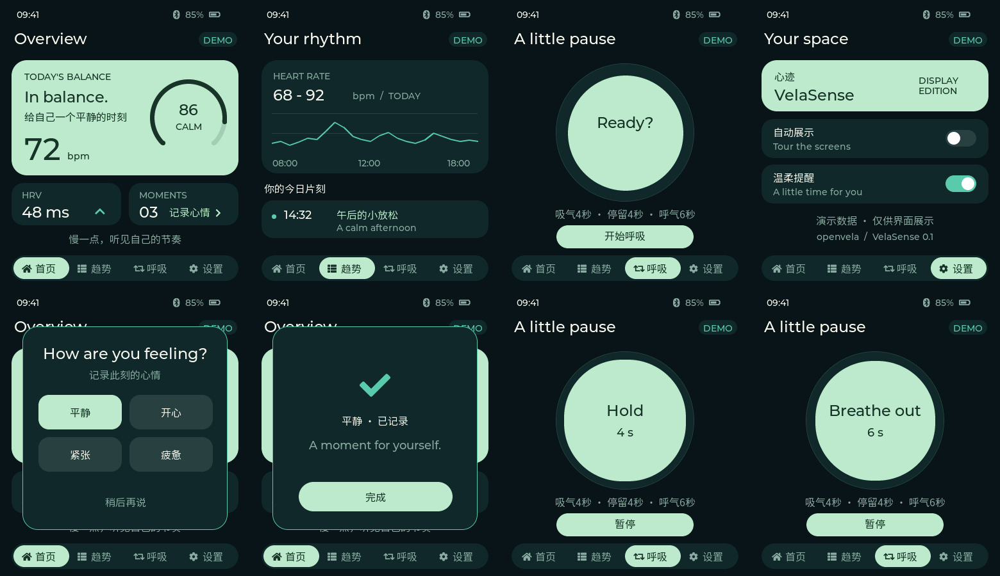

# VelaSense · 腕式情绪关怀终端

队伍：moyumanbo（377） · 方向：AI 硬件产品创新。

VelaSense 的目标是以腕式生理信号和交互界面辅助情绪觉察。本次提交交付的是 **SF32LB52-DevKit-LCD 上可显示、可演示的 UI 原型**：开机直接进入界面，包含首页、趋势、呼吸练习、设置和心情弹窗。

**当前所有心率、HRV、平静指数、时间、电量和趋势均为样例数据。** 本版本不进行真实情绪识别，不接入传感器、云端大模型或蓝牙；不作医疗或心理诊断。仓内早期完整功能代码保留在 `firmware/`，未集成到本次演示固件，也不代表已经完成实机验证。

上图由相同 UI 源码在主机端渲染，不是实物照片。实机测试记录与限制见 [验证记录](docs/demo/validation.md)。

## 已完成与未完成

| 内容 | 本次状态 |
| --- | --- |
| CO5300 390×450 显示、正常配色、中文字体 | 已在实机点亮并确认显示；启动字形检查 0 个缺字 |
| 四个页面、心情弹窗、自动轮播 | 已实现；主机交互检查通过 |
| 呼吸练习 | 4 秒吸气、4 秒停留、6 秒呼气的演示动画；可开始/暂停 |
| 呼吸待机界面 | 保留 Ready? 与下方阶段说明，移除重复的 4:4:6 |
| FT6146 触摸 | 实机设备初始化成功；触摸定位和边缘操作仍需全面验证 |
| 传感器、算法、TinyML、蓝牙、云服务 | 早期代码/设计，不在本次演示中启用 |
| 持久化、功耗、睡眠唤醒、量产可靠性 | 未验收 |

## 目录

- `app/velasense_demo/`：本次启动运行的 LVGL 演示程序与中文字体。
- `board/velasense/configs/ui_demo/`：显示演示固件配置。
- `board/velasense/patches/`：基于公共 BSP 确切版本的完整依赖补丁。
- `tools/build_ui_demo.py`：ARM 固件构建入口。
- `tools/ui_preview/`：使用相同 LVGL/UI 源码的主机预览与交互检查。
- `docs/demo/`：预览、验证记录、依赖版本和提交说明。
- `firmware/`、`docs/specs/`：早期完整产品实现和设计，当前未集成/未验收。
- `logs/INKT-love/`：AI Coding 日志及归集说明。

## 获取与构建

需要 Linux 或 WSL2、Python 3、CMake、Git，以及按官方教程同步的 openvela 工作区。ARM GCC 和 Ninja 使用工作区的 `prebuilts/`。Kconfig 使用 `kconfiglib`（例如 `python3 -m pip install --user kconfiglib`，受系统 Python 策略限制时使用虚拟环境）。

~~~sh
mkdir VelaSense && cd VelaSense
repo init -u https://github.com/open-vela/contest2026_377_moyumanbo \
  -b dev-ai-contest-2026 -m contest2026_377_moyumanbo.xml
repo sync -c -j8
~~~

团队 PR 合入前，在新工作区中获取本次提交分支：

~~~sh
git -C contest2026_377_moyumanbo fetch \
  https://github.com/INKT-love/contest2026_377_moyumanbo feature/velasense-submit
git -C contest2026_377_moyumanbo switch --detach FETCH_HEAD
~~~

### 屏幕驱动依赖

本版本依赖 `vendor/sifli` 的显示适配；仅同步官方基线不能保证本演示正常显示。

完整补丁基于 `open-vela/vendor_sifli` 的 `af6f365eaa04a674af0467aa1a803bc4c77691ba`。在**新建、无本地改动的验证工作区**中：

~~~sh
git -C vendor/sifli switch --detach af6f365eaa04a674af0467aa1a803bc4c77691ba
git -C vendor/sifli apply --check \
  ../../contest2026_377_moyumanbo/board/velasense/patches/vendor-sifli-co5300-demo.patch
git -C vendor/sifli apply \
  ../../contest2026_377_moyumanbo/board/velasense/patches/vendor-sifli-co5300-demo.patch
~~~

已应用补丁、或已经包含对应 BSP 提交的工作区不要重复应用。补丁对应的独立 BSP 提交为 `3de4b2cd50ef85069e26e7a63c17a2fa780296d2`；官方公共仓的合入需要维护者 review，详见 [提交说明](docs/demo/submission.md)。

验证所用 openvela 依赖版本记录于 [workspace-revisions.json](docs/demo/workspace-revisions.json)。特别注意 LVGL 是 manifest 中的独立仓库 `apps/graphics/lvgl/lvgl`，使用 openvela 的 `0f2a49f588505a00e8b46e25a34581c87291a62a`（9.1.0）；不要用原生 LVGL ZIP 代替该适配仓库。

~~~sh
python3 contest2026_377_moyumanbo/tools/build_ui_demo.py
~~~

产物：`cmake_out/velasense_ui_demo/nuttx`（ELF）、`nuttx.bin`（应用固件）。脚本自动建立应用映射，配置更改时重新展开 Kconfig；不构建 `firmware/apps/velasense/`。

### 烧录

开发板：SF32LB52-DevKit-LCD，CO5300 390×450，FT6146。使用官方 [OpenSiFli/sftool](https://github.com/OpenSiFli/sftool) 0.2.5，将 `nuttx.bin` 复制到 Windows 后执行（串口名替换为实际设备）：

~~~powershell
.\sftool.exe -c SF32LB52 -p COM11 -b 1000000 --compat true write_flash --verify nuttx.bin@0x12010000
~~~

已测试设备需要 `--compat true`。该命令只写应用区，保留板上已有引导程序；本提交不包含 bootloader。不要对其他板型直接套用地址。关闭占用串口的终端后烧录。

串口诊断：1000000 baud，8N1，无流控，DTR/RTS 关闭。

~~~text
velasense status
velasense page 0
velasense page 1
velasense page 2
velasense page 3
~~~

页面编号依次为首页、趋势、呼吸、设置。`frames` 与 `heartbeat` 应增长。默认每 8 秒轮播；弹窗或呼吸练习期间暂停轮播。重启不保留设置和心情。

## 主机预览

完成工作区同步后：

~~~sh
cmake -S contest2026_377_moyumanbo/tools/ui_preview -B cmake_out/velasense_ui_preview
cmake --build cmake_out/velasense_ui_preview --parallel 8
mkdir -p /tmp/velasense-preview
cmake_out/velasense_ui_preview/velasense_preview /tmp/velasense-preview
~~~

输出 PPM 图片，并检查导航、弹窗、呼吸阶段、轮播及 400 次切页。主机预览不能替代实机触摸、功耗和可靠性验证。

## AI Coding 使用说明

早期使用 Claude Code/MiMo 协作进行需求拆解、模块编写和设计。后续使用 Codex 审阅项目、完成隔离的 UI 演示、调试定时器和屏幕传输、修正配色和中文字体、验证主机交互，并整理本次提交。

用户逐轮提供实机反馈（黑屏、异常颜色、缺字、布局调整），据此修复界面。当前仓库的功能说明以本 README 和验证记录为准；早期提交标题中的“complete”等描述不作为完成度证明。

[AI 日志清单](logs/INKT-love/manifest.json) 与 [导出范围](logs/INKT-love/EXPORT_NOTES.md) 说明了工具、时间和日志完整性。本次 Codex 导出为用户可见文本快照，未包含工具输出；凭据、个人目录、系统指令和私有推理不会公开。中文字体采用 Noto Sans CJK SC 子集，许可证与生成说明见 `app/velasense_demo/fonts/`。

## 提交路径

开发提交推送到 [个人 fork](https://github.com/INKT-love/contest2026_377_moyumanbo)，再通过 PR 合入 [官方团队仓](https://github.com/open-vela/contest2026_377_moyumanbo) 的 `dev-ai-contest-2026`。公共 BSP 另向对应官方公共仓发起 PR。

流程依据：[官方代码提交指南](https://github.com/open-vela/docs/blob/dev-ai-contest-2026/zh-cn/contest_2026/code_submission_guide.md)、[AI Coding 日志指南](https://github.com/open-vela/docs/blob/dev-ai-contest-2026/zh-cn/contest_2026/ai_coding_log_guide.md)。
